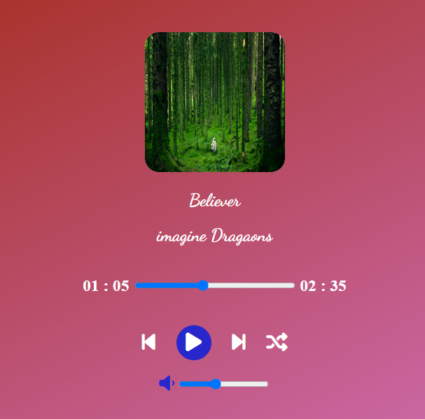

# Music Player - JS
## Techniques Used
- html
- css
- JavaScript

### Time Taken : 1 day

### Features added in this project
- Normal play and pause process using play(), pause(), load() funtions.
- getting previous and next track of a song array.
- Shuffling of tracks also added.
- By adjusting the range of current track input and volume input values, current time and volume of an audio can be changed.
- Backgroung color will be changed for each audio track.

